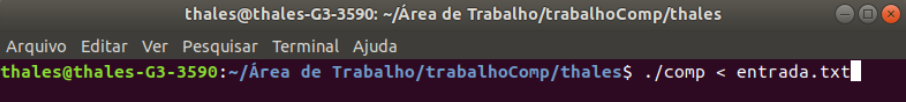

# Analisador léxico de linguagem C
Implementação de um analisador léxico utilizando Flex para analisar uma linguagem C.

## O que é um analisador léxico?
 Um analisador léxico, ou scanner, é um programa que implementa um autômato finito, reconhecendo (ou não) strings como símbolos válidos de uma linguagem. A implementação de um analisador léxico requer uma descrição do autômato que reconhece as sentenças da gramática ou expressão regular de interesse. A sentença a ser reconhecida é estruturada como uma lista de símbolos, que é passada como argumento para o analisador léxico juntamente com a referência para o autômato.
  
 Em linguagens de programação é o analisador léxico que analisa o código fonte para verificar se todas as sentenças fazem parte da linguagem e, para isso, transforma as strings em _tokens_. Um _Token_ em computação é um segmento de texto ou símbolo que pode ser manipulado por um analisador sintático, que fornece um significado ao texto, ou seja, é um conjunto de caracteres com um significado coletivo. Esses _tokens_ são passados para o analisador sintático, que irá verificar se a estrutura gramatical do código está correta.
  
 Analisadores léxicos podem ser implementados em linguagens de programação para reconhecer e verificar uma sequência de strings e gerar os _tokens_. Devido à complexidade de implementação de um analisador existem geradores automáticos que facilitam o trabalho de criar um desses para sua linguagem regular. Nesse trabalho será utilizado o Flex (_fast lexical analyzer generator_), que a partir das regras de gramática impostas gera automaticamente um analisador léxico em linguagem C.

## Construindo uma linguagem regular
 As descrições da linguagem regular irão definir as regras e os símbolos aceitos na nossa linguagem. Definir o alfabeto e as expressões regulares da sua linguagem é o ponto mais importante da criação de um analisador léxico. Para esse trabalho foi tomada como referência a linguagem de programação C.

### Alfabeto
 O alfabeto é o conjunto de todos os caracteres que irão formar as strings da nossa linguagem regular. O alfabeto estabelecido para essa linguagem é:
 - Σ = (0, 1, ..., 9, a, ..., z, A, ..., Z, //, , +, -, *, /, %, =, <, >, !, {, }, ; , ', , , ", ., #, &, (, ), [, ])

### Regras da linguagem regular
 Para a construção dessa linguagem foi tomado como base a linguagem de programação C, assim sendo, foram utilizadas algumas sentenças da linguagem C para a construção desta linguagem regular replicando alguns valores de palavras reservadas, valores booleanos, tipos de variáveis, operadores matemáticos, operadores relacionais e símbolos estruturais. Especificamente, os valores dessas categorias para a gramática implementada são:
- Palavras reservadas: for, if, else, do, while, main, return, printf, scanf, include e define;
- Valores booleanos: true e false;
- Tipos de variáveis: int, char, bool, float e double;
- Operadores matemáticos: +, *, /, %, -, ++, --, +=, -=, /=, *= e %=;
- Operadores relacionais: =, <, >, !, ==, <=, >= e !=;
- Símbolos estruturais: {, }, ;, ', ,, ", ., #, &, ( e ).

Cadeias de caracteres começadas com letras (a, ..., z, A, ..., Z) e seguidas de letras ou números serão consideradas nomes de variáveis. Números reais devem utilizar "." para separar a parte inteira e a fracionaria (ex: 120.2). Não serão aceitas nessa linguagem:
1. Cadeias de caracteres iniciadas com números e seguidas de letras (ex: 123var);
2. Números reais utilizando "," (ex: 120,2).
3. Qualquer caractere fora do alfabeto.

OBS: Após o analisador encontrar o símbolo "//" todos os caracteres posteriores naquela linha serão ignorados, pois serão considerados um comentário.

## Criando um analisador léxico com Flex
### Preparando o ambiente
O Flex é um framework que auxilia na criação de analisadores léxicos, e para ter acesso a suas bibliotecas é necessário instalar as dependências.

Pré-requisitos:
- Sistema operacional Linux: Ubuntu;
- Compilador C: GNU Compiler Collection (GCC).

Para instalar o Flex primeiramente abra o terminal e digite o comando **sudo apt-get install flex**. 

Após isso as dependências serão instaladas e o Flex estará pronto para uso.

### Preparação do código
O Flex utiliza arquivos com a extensão **.l** para compilar os analisadores léxicos. Esse tipo de arquivo utiliza recursos de linguagem C, porém tem uma estrutura particular que consiste em três divisões, cada uma delas com suas propriedades para a estrutura do código. A primeira parte é composta de definições, que é onde serão colocados os headers da linguagem C e o alfabeto do analisador léxico. A segunda parte é formada pelas regras da gramática que será especificada pelo desenvolvedor. A terceira parte será formada pelas subrotinas do programa em C (simplificando, aqui será colocada a main() do programa). Essas partes são divididas pelo símbolo "%%" dentro do código. O Flex irá utilizar esse arquivo .l para montar um arquivo **.c** que será o analisador léxico em linguagem C. A Figura abaixo mostra um exemplo de programa Flex. As funções **yywrap()** (linha 21) e **yylex()** (linha 23) são necessárias para a utilização do Flex.

O analisador léxico da linguagem regular proposta nesse trabalho está implementado no arquivo **fonte.l**. Também foi utilizado um arquivo **entrada.txt** que contém a entrada para o analisador léxico.

### Compilação do código
Para compilar o código e começar a utilizar o analisador léxico são necessários três passos:
1. Compilar o arquivo .l:

Para compilar o arquivo .l abra o terminal e vá até o diretório que contém o arquivo e utilize o comando **flex** seguido do **<nome do arquivo>.l**. Ao termino da compilação será gerado um arquivo .c no mesmo diretório. Nesse exemplo o comando executado será flex fonte.l.
 
 
 
 2. Compilar o arquivo .c:
 
Após compilar o arquivo .l, no mesmo diretório estará o arquivo **lex.yy.c**, onde utilizaremos o compilador GCC. Para compilar esse código em linguagem C será utilizado o comando **gcc <nome do arquivo>.c -o <nome do arquivo de saída>**, que nesse caso será **gcc lex.yy.c -o comp**, assim gerando o arquivo **comp** que será o executável com o nosso analisador lexico.

 
 3. Executar o analisador léxico:
 
Para executar o analisador léxico agora é somente necessário iniciar o executável atravez do comando **./<nome do arquivo executável>**, que para este exemplo será **./comp**. Também é possível executar o analisador dando como entrada um arquivo .txt com as strings que serão analisadas utilizando o comando **./<nome do arquivo executável> < <nome do arquivo de entrada>.txt**, então ao final, para este exemplo, utilizando o arquivo de entrada **entrada.txt** temos o comando de execução **./comp < entrada.txt**.

 
 ## Conclusões
O Flex é um framework que facilita o desenvolvimento de analisadores léxicos em linguagem C. Com ele foi possível desenvolver um projeto que analisa os erros léxicos de uma linguagem regular e retorna esses erros para o usuário. Com poucas linhas de código um poderoso analisador léxico pode ser construído para qualquer linguagem regular e gramática informada pelo desenvolvedor.
